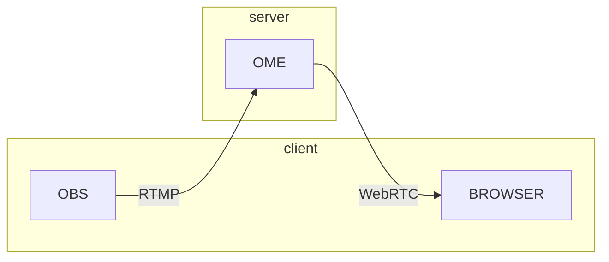
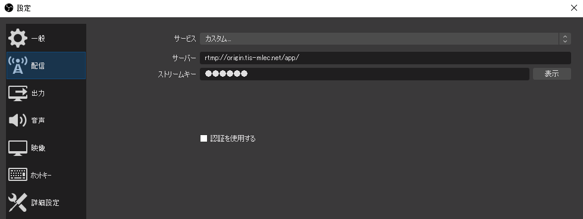
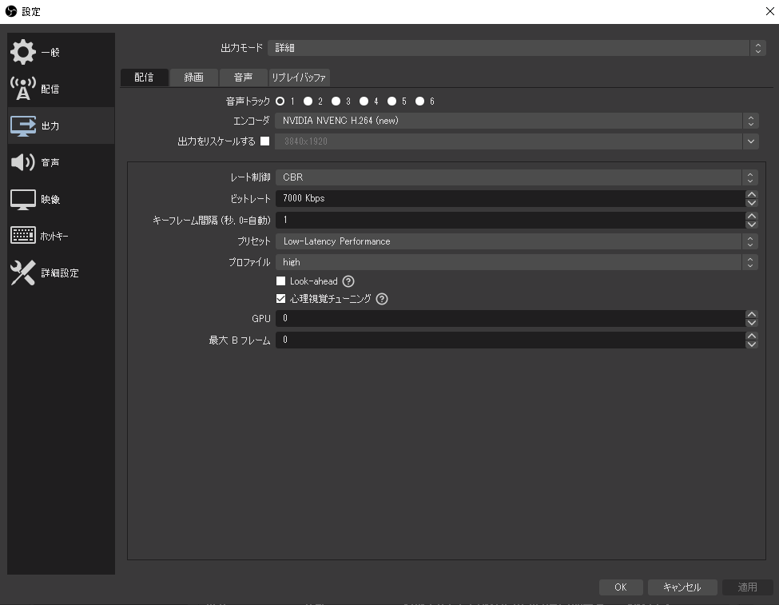
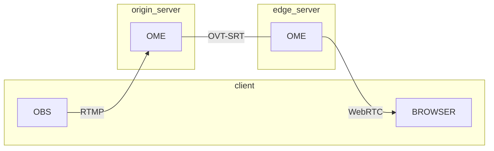

# OvenMediaEngine(OME) on Docker Compose

## Quick Start

### 環境

- Linuxサーバ
  - OvenMediaEngine(OME) on Docker
- 任意のクライアントPC
  - OBS Studio
  - ブラウザ（Google Chrome推奨）



### OvenMediaEngine（OME）の起動

Linuxサーバ上で，DockerとDocker Composeを利用してOMEのコンテナを起動する．

```
sudo docker compose up -d
```

### OBS Studioで配信

クライアントPC上でOBSを起動し，配信の設定をする．

設定画面を開き，配信の設定から以下を設定．

- サービス：カスタム
- サーバー：rtmp://\<SERVER ADDRESS\>:1935/app/
- ストリームキー：stream



出力の設定から詳細を開き，以下のパラメータを設定．

- エンコーダ：NVIDIA NVENC H.264
- レート制御：CBR
- ビットレート：（配信画質やネットワーク帯域に合わせて設定）
- キーフレーム間隔：1
- 最大Bフレーム：0

エンコーダがx264しかない場合はx264を選択し，Tuneをzerolatency，x264オプションにbframes=0を指定する．
PresetはCPU性能によるが，ultrafastなど低負荷なものを選択する．



設定完了後，配信を開始する．

### デモサイトで映像受信確認

クライアントPCのブラウザで[デモサイト](http://demo.ovenplayer.com/demo.html)にアクセスする．

[Playback URL]と記載されたフォームに ws://\<SERVER ADDRESS\>:3333/app/stream と入力し，[ADD SOURCE]ボタンを押す．
さらに[LOAD PLAYER]ボタンを押したあと，動画の再生を確認する．

## OvenMediaEngineの主なサービスと対応するポート番号

### 配信（Provider，Presenter）

- RTMP: 1935
- SRT: 9999
- WebRTC (Signaling)
  - WebSocket: 3333
  - WebSocket Secure: 3334

### 視聴（Publisher，Viewer）

- WebRTC (Signaling)
  - WebSocket: 3333
  - WebSocket Secure: 3334
- LL-HLS
  - HTTP: 3333
  - HTTPS: 3334

### リレー

- OVT-SRT: 9000
- RTMP: （Push）

## OvenMediaEngineの設定

### 配信・視聴エンドポイント

stream の文字列はストリーム名を示す．配信時は任意の文字列を指定し，視聴時は目的のストリーム名を指定する．
RTMPの場合は，URLには含めず別途アプリ等の入力欄でストリームキーを指定する．

- RTMP: rtmp://\<SERVER ADDRESS\>:1935/app
- SRT: srt://\<SERVER ADDRESS\>:9999%?streamid=srt%3A%2F%2F\<SERVER ADDRESS\>:9999%2Fapp%2Fstream
- WebRTC:
  - WebSocket: ws://\<SERVER ADDRESS\>:3333/app/stream
  - WebSocket Secure: ws://\<SERVER ADDRESS\>:3334/app/stream
- LL-HLS
  - HTTP: http://\<SERVER ADDRESS\>:3333/app/stream/llhls.m3u8
  - HTTPS: https://\<SERVER ADDRESS\>:3334/app/stream/llhls.m3u8

### 視聴デモサイト

- TLSなし：
[http://demo.ovenplayer.com/demo.html](http://demo.ovenplayer.com/demo.html)

- TLSあり：
[https://demo.ovenplayer.com/demo.html](https://demo.ovenplayer.com/demo.html)


### TLS/SSLの設定

./sample.env に以下の記載があることを確認し，keysディレクトリに証明証ファイルを配置する．
コンテナ起動時にkeysディレクトリ内の証明書ファイルがマウントされ，OMEはアプリケーション起動時にファイルを読み込む．

```
# 使用する証明書ファイル
SSL_SERVER_CERT=./keys/cert.pem
SSL_SERVER_KEY=./keys/privkey.pem
SSL_SERVER_CHAIN=./keys/chain.pem
# コンテナ内に配置する証明書のファイルパス
OME_TLS_CERT_PATH=/opt/ovenmediaengine/bin/cert.pem
OME_TLS_KEY_PATH=/opt/ovenmediaengine/bin/privkey.pem
OME_TLS_CHAIN_PATH=/opt/ovenmediaengine/bin/chain.pem
```

証明書の取得は，以下のようにcertbotを使ってワイルドカード証明書を取得するとよい．

```
certbot certonly --manual --server https://acme-v02.api.letsencrypt.org/directory --preferred-challenges dns -d *.tis-mlec.net -m okada.hiroki.065@tis.co.jp --agree-tos
```

上記コマンドを実行すると，/etc/letsencrypt/archive/tis-mlec.net/ 配下に証明書ファイルが生成される．

```
cert1.pem  chain1.pem  fullchain1.pem  privkey1.pem
```

ファイル名から数字を取り除き，chain.pem, privkey.pem, cert.pemの3つのファイルをkeysディレクトリ下に配置する．

### リレー（Origin-Edge）の設定

OMEは別のOMEに配信映像を転送（リレー）する機能を持つ．
ここではリレー元のサーバをオリジンサーバ，リレー先のサーバをエッジサーバと呼ぶ．



リレー機能を有効にするには，エッジサーバの ./sample.env にある `OME_DEFAULT_ORIGIN_SERVER_ADDR` の値を編集する．
オリジンサーバのアドレスが `origin.tis-mlec.net` の場合は以下のように設定する．

```
OME_DEFAULT_ORIGIN_SERVER_ADDR=origin.tis-mlec.net:9000
```

変数を設定後，コンテナを起動する．

エッジサーバはクライアントから映像ストリームのリクエストを受けると，自動的に指定したオリジンサーバから映像を取得し，クライアントに映像を返す．

# Ansible 環境構築

OMEServer を稼働させるために必要な仮想マシンの環境設定は，Ansible で設定できる

ansible-playbook コマンドで必要なファイルは以下の通り．

- hosts: インベントリファイル
- playbook: プレイブック
